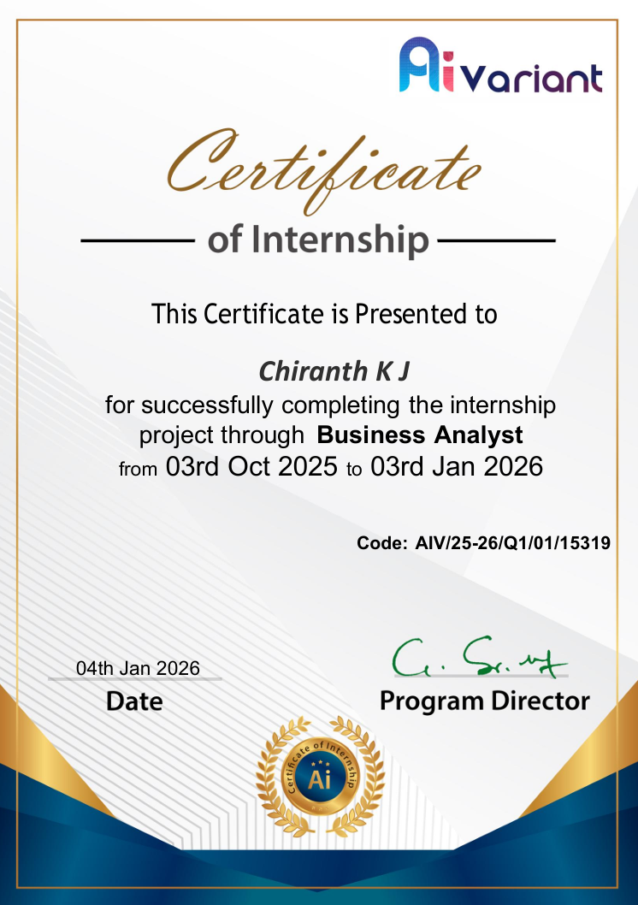

# 📜 Internship Certificates – Chiranth K J  

This repository contains my verified internship completion certificates for recruiter reference and portfolio validation.

---

## 👨‍💻 About Me  
Entry-level Business & Data Analyst with hands-on experience in data analysis, data cleaning, MIS reporting, KPI tracking, and dashboard development using Excel, SQL, Python, Tableau, and Power BI.

🔗 Portfolio: https://chirugow.github.io  
🔗 GitHub: https://github.com/Chirugow  
🔗 LinkedIn: https://www.linkedin.com/in/chiranthkj/  

---

## 📂 Internship Certificates  

---

### 🔹 Business Analyst Intern – Ai Variant  
**Duration:** October 2025 – January 2026  

**Skills Used:**  
- Power BI Dashboard Development  
- KPI Tracking & Business Reporting  
- Sales & Crowdfunding Data Analysis  
- Data Cleaning, Trend & Segment Analysis  

📜 Certificate Preview:  

---

### 🔹 Web Development Intern – SRISADGURU Hypertechnologies Pvt. Ltd  
**Duration:** March 2025 – May 2025  

**Skills Used:**  
- Python, R, Excel for Data Analysis  
- Data Cleaning & Validation  
- MIS Reporting & KPI Support  
- Backend Data Processing  

📜 Certificate Preview:  

---

## ⭐ Note  
This repository is created for recruiter verification and professional portfolio purposes.
